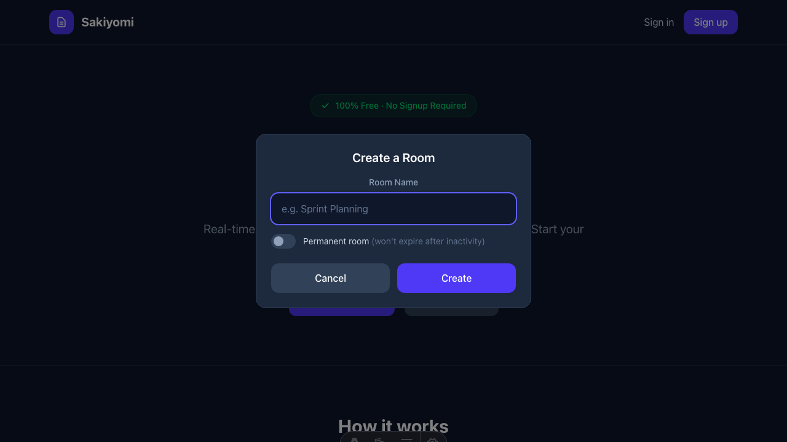
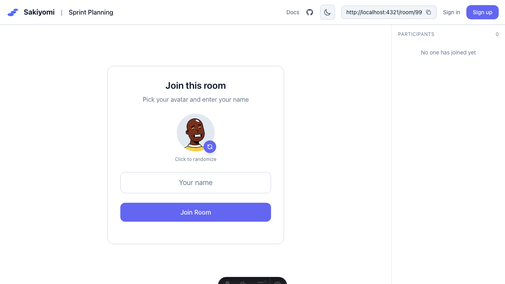

Rooms are where your team collaborates on story point estimation.

## Creating a Room

1. Click **Create Room** on the homepage
2. Enter a descriptive room name
3. Optionally toggle **Permanent room**
4. Click **Create**

## Room Types

### Temporary Rooms (Default)
- Automatically deleted after inactivity
- Great for one-off planning sessions

### Permanent Rooms
- Stay active indefinitely
- Ideal for recurring team meetings
- Toggle "Permanent room" when creating

## Room Settings

Managers can access room settings by clicking the gear icon:

- **Room Name**: Change the room's display name
- **Vote Options**: Customize the voting scale
- **Show Votes**: Toggle whether participants can see their own vote

## Joining an Existing Room

Share the room URL with your team. When they open it:
1. They'll see the join form
2. Pick an avatar
3. Enter their name
4. Click **Join Room**

No account or signup required!
