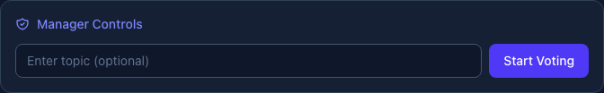

Managers have special controls to facilitate smooth estimation sessions. This page covers managing participants within a room. For organizational teams with persistent membership, see [Teams](/features/teams/).

## Roles

### Manager
- Start/stop voting rounds
- Reveal votes
- Change room settings
- Promote/demote other managers
- Kick participants

### Participant
- Vote on stories
- See revealed results
- Change their avatar and name

## Managing Participants

Each participant row shows action buttons when you're a manager:

### Promoting to Manager
1. Find the participant in the sidebar
2. Click the sparkle/star icon (⭐)
3. They now have manager controls

### Demoting a Manager
1. Click the down arrow icon next to their name
2. They return to participant role

### Kicking Participants
1. Click the X icon next to their name
2. Confirm the action
3. They'll be removed and need to rejoin

## Presence Indicators

- **Green dot** - Online and active
- **No dot** - Offline or disconnected
