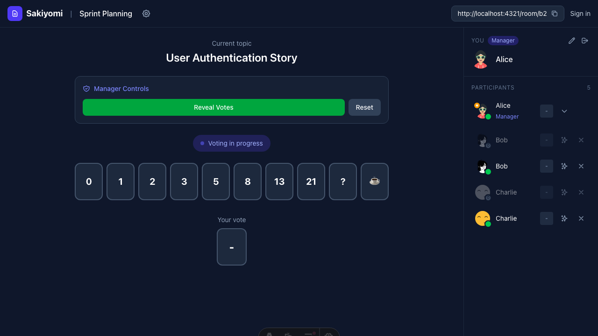
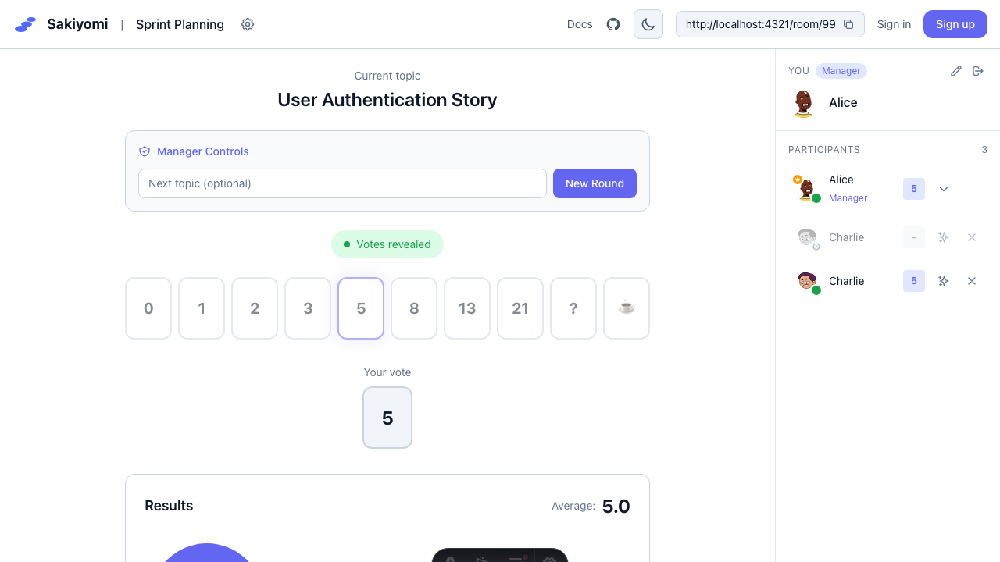

The voting system is designed to eliminate anchoring bias and encourage independent thinking.

## How Voting Works

1. **Manager starts voting** - Enters a topic and clicks "Start Voting"
2. **Team votes privately** - Each person selects their estimate
3. **Votes are hidden** - No one can see others' votes until revealed
4. **Manager reveals** - All votes shown simultaneously
5. **Discussion** - Team discusses differences and reaches consensus

## Vote Options

Default options follow the modified Fibonacci sequence:
`0, 1, 2, 3, 5, 8, 13, 21, ?, ☕`

- **?** - Unsure / need more information
- **☕** - Need a break

### Custom Vote Options

Managers can customize options in room settings:
- Fibonacci: 1, 2, 3, 5, 8, 13, 21
- T-shirt sizes: XS, S, M, L, XL
- Powers of 2: 1, 2, 4, 8, 16
- Custom values

## Voting States

| State | Description |
|-------|-------------|
| Waiting | No active vote |
| Voting | Team is selecting estimates |
| Revealed | All votes visible |

## Best Practices

1. **Don't anchor** - Vote before discussing
2. **Use "?"** - When you need more context
3. **Discuss outliers** - High/low voters share their reasoning
4. **Re-vote if needed** - Use "Reset Votes" to try again
