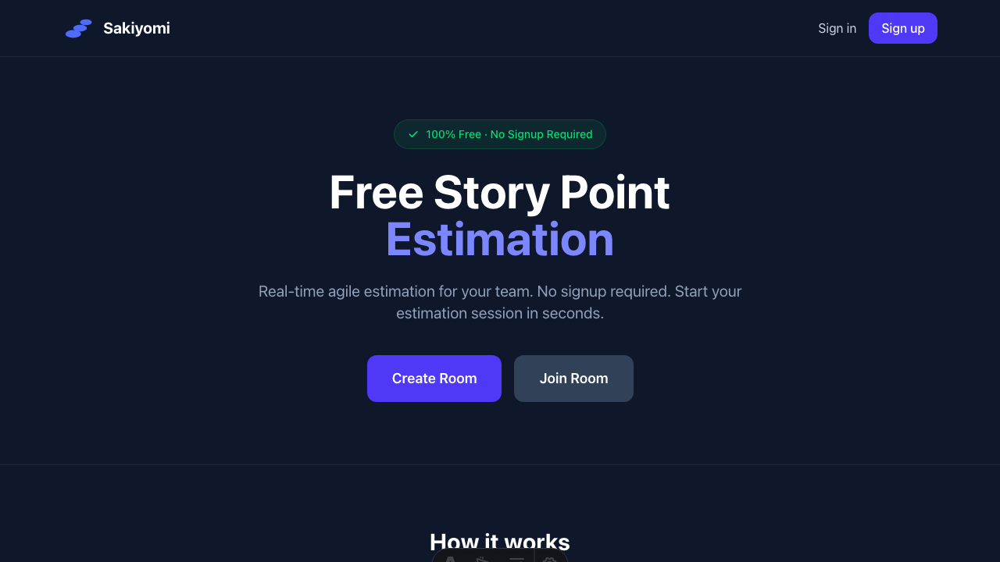

Storypoint Estimate is a **free, open-source** story point estimation tool designed for agile teams. It enables real-time collaboration during sprint planning sessions without requiring any signup.

## Key Features

- **No signup required** - Start estimating in seconds
- **Real-time collaboration** - See votes as they happen
- **Team management** - Promote managers, kick participants
- **Custom vote options** - Use Fibonacci, T-shirt sizes, or custom values
- **Privacy-first** - Votes are hidden until revealed

## Why Storypoint Estimate?

Traditional estimation meetings can be slow and biased. When one person speaks first, they anchor the entire team's thinking. Storypoint Estimate solves this by:

1. **Anonymous voting** - Everyone votes independently
2. **Simultaneous reveal** - All estimates shown at once
3. **Discussion prompts** - High/low voters can explain their reasoning

## Open Source

Storypoint Estimate is open source under the MIT license. You can:

- Self-host on your own infrastructure
- Contribute improvements
- Fork and customize for your team

[View on GitHub](https://github.com/thatcatdev/sakiyomi)
